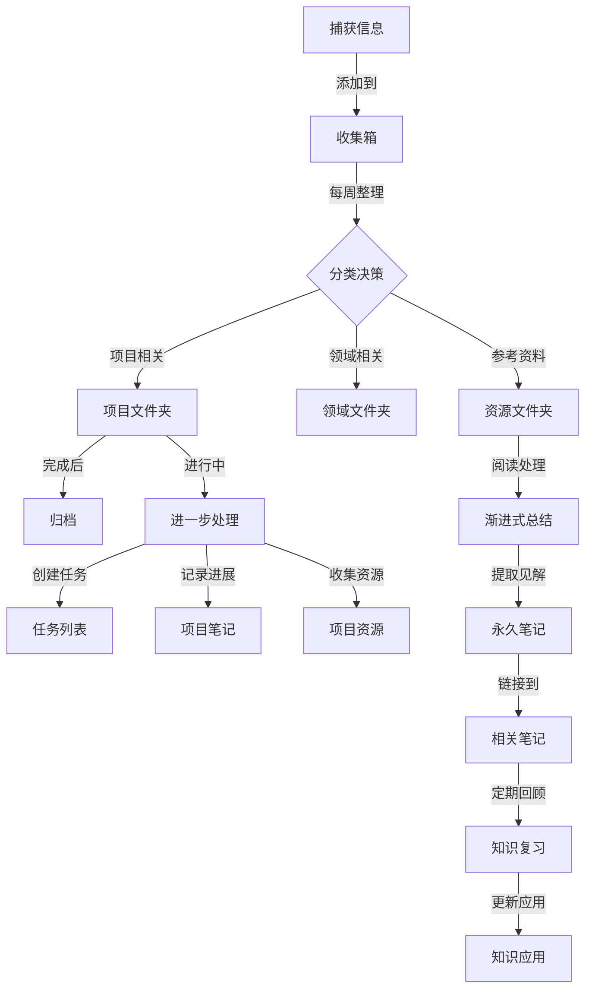

# 第二大脑工作流程

## 第二大脑工作流程说明

1. 捕获阶段：随时将想法、灵感、信息添加到收集箱
2. 整理阶段：每周对收集箱内容进行分类和处理
3. 提炼阶段：将资源通过渐进式总结转化为个人知识
4. 应用阶段：定期回顾笔记，将知识应用到项目中

## 每日工作流

1. 早晨：查看日记，确定当天优先事项
2. 全天：将新想法和信息捕获到收集箱
3. 傍晚：回顾当天进展，完成日记反思部分
4. 每周固定时间：处理收集箱，更新项目状态

## 最佳实践

- 保持收集箱整洁，不让积压超过一周
- 为重要概念创建永久笔记，注重个人见解
- 定期回顾和更新MOC页面，维护知识网络
- 使用标签系统标记需要回顾的内容